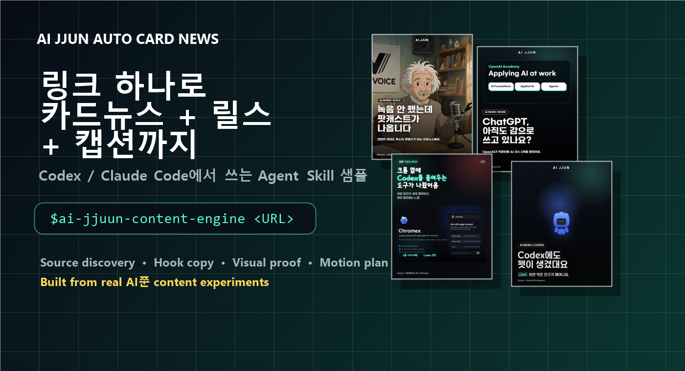
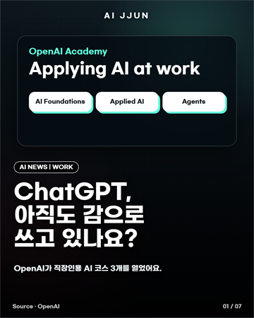
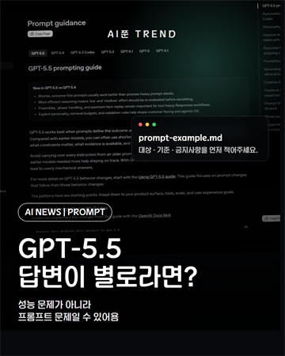
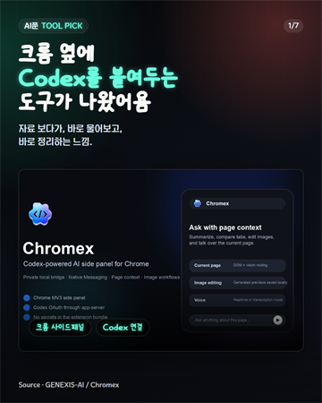
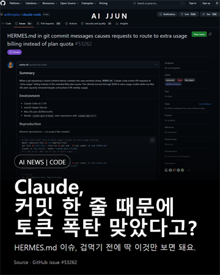
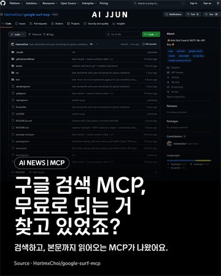
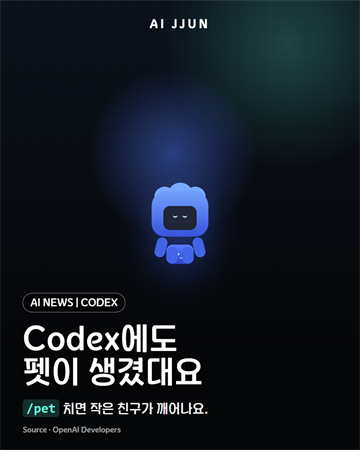
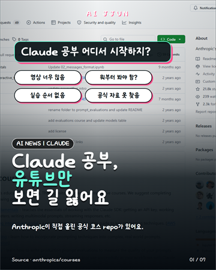
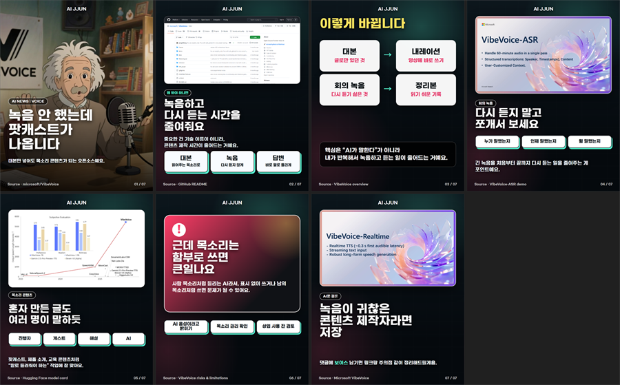
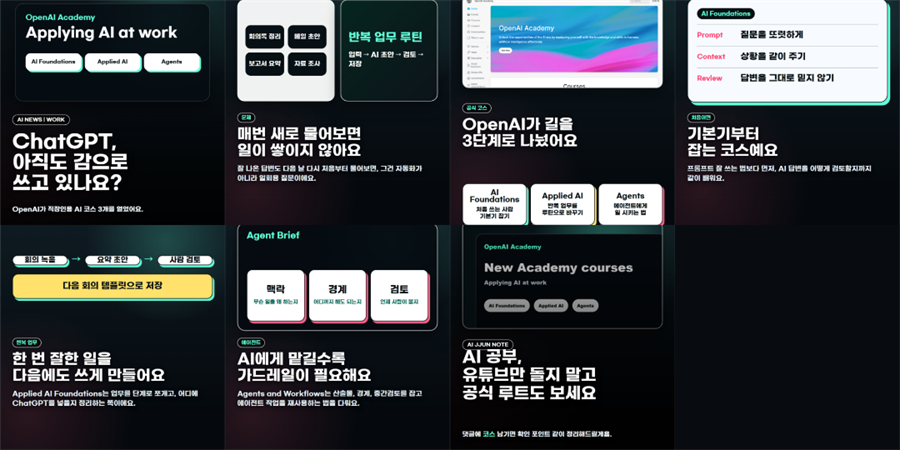

# AIjjuun Auto Card News

Version: `0.5.1`

<p align="center">
  
</p>

<p align="center">
  
</p>

<p align="center">
  <a href="#quick-start-for-codex"></a>
  <a href="#quick-start-for-claude-code"></a>
  <a href="#example-output-package"></a>
  <a href="#ai쭌-production-rules"></a>
</p>

<p align="center">
  <a href="README.md">English</a> ·
  <a href="docs/i18n/README.ko.md">한국어</a> ·
  <a href="docs/i18n/README.ja.md">日本語</a> ·
  <a href="docs/i18n/README.zh-CN.md">中文</a>
</p>

> [!TIP]
> 스킬 깔고 링크 하나만 던지면, AI 뉴스/깃허브/툴 소스를 카드뉴스 + 릴스 플랜 + 캡션으로 패키징하는 샘플입니다.  
> “그냥 요약”이 아니라, 후킹 → 실제 사용 장면 → 짧은 한국어 카피 → 출처 링크 → 댓글/저장 유도까지 잡는 걸 목표로 해요.

Turn one source link into an Instagram-ready AI news package:

- card-news carousel
- short Reel / Shorts plan
- caption
- source pack
- visual direction
- QA checklist

This repository is a public skill sample for creators who want to make AI trend content with Codex or Claude Code.

## Hermes Automation Loop

For AI JJUN's local workflow, Hermes can keep scouting sources while the PC is on:

```powershell
powershell -ExecutionPolicy Bypass -File tools\automation\register-hermes-task.ps1 -RefreshSources
```

That scheduled task runs every hour and follows this approval-first loop:

```text
search hype sources
  -> Telegram source approval
  -> Codex draft
  -> Telegram draft approval
  -> Codex final card-news + Reel + caption
  -> Telegram upload approval
  -> optional Meta API upload later
```

Manual source intake is also supported:

```powershell
powershell -ExecutionPolicy Bypass -File tools\automation\hermes-add-source.ps1 -Url "https://example.com/source" -Title "source title"
```

> AI쭌 카드뉴스 자동화: 스킬 깔고 링크 하나만 던지면, 카드뉴스 + 릴스 + 캡션 제작 흐름을 알아서 잡아주는 Agent Skill 샘플입니다.

## Meet The Demo

```text
$ai-jjuun-content-engine
https://github.com/microsoft/markitdown

AI쭌 카드뉴스 자동화로 만들어줘.
카드뉴스 7장, 릴스 플랜, 캡션, 출처 링크까지.
첫 장은 실제 사용 장면이나 제품 이미지 중심으로 후킹되게 잡아줘.
```

The intended output is a creator-ready package:

```text
source link
  -> verified source pack
  -> viewer-first hook
  -> card storyboard
  -> visual reference plan
  -> motion / Reel plan
  -> caption with source links
```

## Preview Gallery

These are real AI쭌 card-news outputs used as style references for this skill.

<table>
  <tr>
    <td align="center"><br><sub>VibeVoice</sub></td>
    <td align="center"><br><sub>OpenAI Academy</sub></td>
    <td align="center"><br><sub>GPT-5.5 Prompting</sub></td>
    <td align="center"><br><sub>Chromex</sub></td>
  </tr>
  <tr>
    <td align="center"><br><sub>Hermes Issue</sub></td>
    <td align="center"><br><sub>Google Surf MCP</sub></td>
    <td align="center"><br><sub>Codex Pets</sub></td>
    <td align="center"><br><sub>Anthropic Courses</sub></td>
  </tr>
</table>

<details>
<summary>More preview sheets</summary>

<p>
  
</p>
<p>
  
</p>

</details>

## Why This Exists

Most AI news posts fail in the same way:

- too much official-blog summary
- too many stiff translated sentences
- no real screenshot, demo, or use case
- no reason to save, comment, or follow
- no bridge from “interesting news” to “how this helps my work”

This skill tries to fix that. It turns a source into a social content package that feels like a Korean AI tutor/curator, not a pasted research memo.

## Tech Stack

| Area | Tools / Engines |
| --- | --- |
| Agent format | `SKILL.md`, Codex Skills, Claude Code Skills |
| Source discovery | `last30days`, official docs, GitHub, GeekNews, X/Threads, Reddit, YouTube demos |
| Visual proof | screenshots, product pages, demo clips, generated key images |
| Card rendering | HTML/CSS, Playwright-friendly layout, PNG export planning |
| Motion | HyperFrames-first, Remotion fallback |
| Copy QA | Korean-native humanized copy, short card copy, caption source links |
| Positioning | AI쭌 content memory, AX consulting bridge |

## Channels

- Instagram: [@ai_jjuun](https://www.instagram.com/ai_jjuun/)
- Threads: [@ai_jjuun](https://www.threads.com/@ai_jjuun)
- YouTube: [AI쭌](https://www.youtube.com/@AI%EC%AD%8C)

## Creator Notes

> “기능명이 아니라 사람이 얻는 결과로 설명해야 저장됩니다.”

> “첫 장은 GitHub 첫 화면 캡처보다 실제 사용 장면, 데모, 제품 이미지가 더 강합니다.”

> “카드뉴스만 만들면 약합니다. 릴스까지 같이 만들어야 계정이 살아납니다.”

## What It Does

Give the agent a URL, GitHub repo, official blog post, X/Threads post, GeekNews link, Reddit thread, paper, or memo.

The skills guide the agent to:

- verify the source instead of copying viral posts blindly
- find official docs, demos, screenshots, community reactions, and related GitHub repos
- frame the topic for Korean AI-curious viewers
- write short, human Korean copy instead of translated AI summaries
- create an engagement-first carousel storyboard
- plan or produce motion cards and Reels with HyperFrames or Remotion
- write a compact Instagram / Threads caption with useful source links
- connect the content to practical AX consulting angles

The goal is not “pretty slides.” The goal is:

```text
source link -> useful angle -> hook -> visual proof -> card-news -> Reel -> caption
```

## Included Skills

| Skill | Use it when |
| --- | --- |
| `ai-jjuun-content-engine` | You want the full AI쭌 production system: source discovery, hook, copy, visual, Reel, caption, QA, and AX bridge |
| `auto-card-news` | You want a card-news / Instagram carousel workflow |
| `auto-motion-news` | You want a Reel, Shorts, motion card, or script-to-video package |
| `last30days` | You want fresh source discovery from the web |

## Quick Start For Codex

### One-Line Install

Windows PowerShell:

```powershell
powershell -ExecutionPolicy Bypass -Command "iwr -useb https://raw.githubusercontent.com/AIjunja/Auto-card-news/master/install.ps1 | iex"
```

macOS / Linux:

```bash
curl -fsSL https://raw.githubusercontent.com/AIjunja/Auto-card-news/master/install.sh | bash
```

Restart Codex after installation.

### Use In Codex

Paste this into Codex:

```text
$ai-jjuun-content-engine
https://openai.com/index/academy-courses-applying-ai-at-work

AI쭌 채널용으로 카드뉴스랑 릴스랑 캡션 만들어줘.
실제 사용 이미지/영상 소스도 찾아보고, 첫 장은 후킹되게 잡아줘.
```

You can also call the base skills directly:

```text
$auto-card-news
<source URL>

$auto-motion-news
<script or source URL>
```

## Quick Start For Claude Code

Claude Code can use the same `SKILL.md`-based skill folders.

### One-Line Install

Windows PowerShell:

```powershell
powershell -ExecutionPolicy Bypass -Command "iwr -useb https://raw.githubusercontent.com/AIjunja/Auto-card-news/master/install-claude.ps1 | iex"
```

macOS / Linux:

```bash
curl -fsSL https://raw.githubusercontent.com/AIjunja/Auto-card-news/master/install-claude.sh | bash
```

Restart Claude Code after installation.

### Use In Claude Code

Paste a request like this:

```text
Use the ai-jjuun-content-engine skill.

Source:
https://github.com/microsoft/markitdown

Make an AI쭌-style Korean card-news package:
- 7-card carousel
- Reel plan
- caption
- source links
- visual references
- no stiff translated Korean
- explain why viewers should care
```

## Manual Install

### Codex

Copy skills into your Codex skills directory:

```text
~/.codex/skills/
```

Required folders:

```text
skills/ai-jjuun-content-engine
skills/auto-card-news
skills/auto-motion-news
```

Recommended companion:

```text
https://github.com/mvanhorn/last30days-skill/tree/main/skills/last30days
```

### Claude Code

Copy the same skill folders into your Claude skills directory:

```text
~/.claude/skills/
```

Required folders:

```text
skills/ai-jjuun-content-engine
skills/auto-card-news
skills/auto-motion-news
```

Recommended companion:

```text
https://github.com/mvanhorn/last30days-skill/tree/main/skills/last30days
```

## Example Output Package

A typical project folder should contain:

```text
source.md
source-pack.md
brief.md
storyboard.md
motion-plan.md
caption.md
design.md
cards/
output/
  card-01.png
  card-02.png
  ...
  reel-preview.mp4
  contact-sheet.png
  thumbnail-sheet.png
```

The exact rendering depends on the local agent environment, browser tools, image tools, HyperFrames, Remotion, and available media sources.

## AI쭌 Production Rules

This repo encodes the production lessons from many AI쭌 content experiments:

- Hook first. The first card or first 3 seconds must show why the viewer should stop.
- Do not make PPT slides. Use real visuals, demos, product screenshots, or generated key images.
- Do not explain technology names first. Start from the viewer’s situation and result.
- Keep Korean copy short, natural, and useful.
- Avoid “AI쭌식” wording. Use `AI JJUN` as branding, but make the explanation viewer-first.
- Use GmarketSans-style readability for Korean card text.
- For Reels, use hook -> explanation -> proof -> comment/save/follow CTA.
- Prefer minor-but-useful AI tools, GitHub repos, GeekNews, X/Threads, Reddit, docs, demos, and product updates over generic official-blog summaries.
- Add a practical AX bridge: how this could help a company, creator, developer, marketer, or solo founder.

## Best Source Types

### Mandatory Hype Mix

When Hermes or Codex searches for sources, do not return an official-blog-only list.
Every source discovery run should first collect and score at least:

- 2 GeekNews/Hacker News-style community signals
- 2 Threads posts or creator posts with visible traction
- 2 X posts from official accounts, builders, researchers, or high-signal practitioners
- 2 currently hyped GitHub repositories, checked for stars, recent commits, README clarity, license, and real use case

Then pair each social or hype signal with a verifying source such as an official doc, changelog, GitHub README, demo video, issue, release note, or product page.

Reject source lists that are mostly generic announcement summaries. AI쭌 should win by finding minor-but-useful tools, practical workflows, security/cost gotchas, and Korean-friendly AX use cases before bigger AI news accounts flatten them into obvious summaries.

Good sources:

- official OpenAI / Anthropic / Google / Microsoft / Figma / Adobe docs
- GitHub repos with clear use cases or hype signals
- GeekNews and Hacker News discussions
- X / Threads posts with strong reactions
- Reddit discussions with practical pain points
- YouTube demos or product videos
- release notes, changelogs, examples, cookbooks, papers

Avoid making content from a single viral post without checking the underlying source.

## What This Is Not

This is not a hosted SaaS.

By default, this repository prepares assets, captions, source notes, QA sheets, and publish queues. It does not upload anything unless you explicitly configure local credentials and run the guarded publishing workflow.

Optional local automation is available for a Hermes-style setup:

```text
Hermes source search
  -> Codex content production
  -> Telegram review
  -> approved-only Instagram / Threads publishing
```

See [`docs/hermes-content-automation.md`](docs/hermes-content-automation.md) and [`docs/publish-automation.md`](docs/publish-automation.md). Upload automation requires official Meta API credentials, account permissions, public media URLs, and your approval for the exact final package.

## Repository Layout

```text
skills/
  ai-jjuun-content-engine/
    SKILL.md
    agents/openai.yaml
    references/
  auto-card-news/
    SKILL.md
    assets/templates/
    references/
    scripts/
  auto-motion-news/
    SKILL.md
    assets/templates/
    references/
    scripts/
docs/
  codex-quickstart.md
  claude-code-quickstart.md
  hermes-content-automation.md
  publish-automation.md
examples/
  hermes-content.env.sample
  hermes-source-inbox.sample.json
  one-link-ai-news-prompt.md
tests/
```

## Verify

```powershell
python -m unittest tests.test_auto_card_news_skill -v
```

The test suite checks the skill metadata, references, templates, scaffold scripts, installer docs, and Claude/Codex distribution files.

## License

This repository is intended as a reusable Agent Skill sample. Check each external media source, font, screenshot, video clip, and GitHub repository license before using it commercially.
